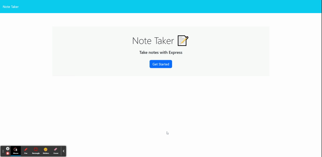

# Note Taker (Module 11 Challenge)

## Description

This is an express application that is all based on note taking. It allows the user to add or delete notes as the user wants and keeps notes organized. All notes will be store on heroku live server that way whenever user visits website, the previous notes will be there. 

## Table of Contents

- [Installation](#installation)
- [Usage](#usage)
- [Credits](#credits)
- [License](#license)

## Installation

Heroku Live app 

Just visit the live application here: https://note-taker-live.herokuapp.com/

## Usage

### Preview of website:

## Credits

Node.js  
https://nodejs.org/en/

Express.js
https://expressjs.com/

Heroku
https://www.heroku.com/

## License

Please refer to the LICENSE in the repo.

---